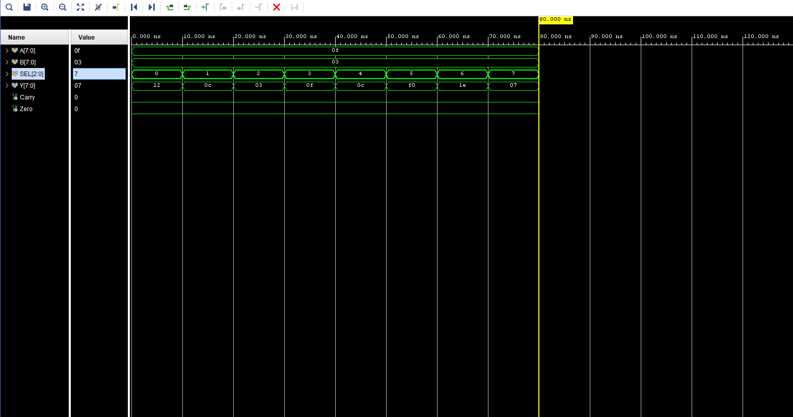

# 8-Bit ALU using Verilog HDL

## Overview
This project implements an 8-bit Arithmetic Logic Unit (ALU) using Verilog HDL.  
The ALU performs arithmetic and logical operations commonly used in digital systems and processor architectures.

## Features
- Addition
- Subtraction
- AND
- OR
- XOR
- NOT
- Left Shift
- Right Shift

## Tools Used
- Xilinx Vivado
- Verilog HDL
- Basys 3 FPGA Board

## Project Structure
```txt
constraints/   -> XDC constraint file
src/           -> Verilog source code
tb/            -> Testbench files
```

## FPGA
- Device: XC7A35TCPG236-1
- Board: Basys 3

## Concepts Used
- RTL Design
- Combinational Logic
- Digital Electronics
- FPGA Design
- Verilog HDL

## Simulation Waveform Explanation

The waveform simulation verifies the correct functionality of the 8-bit ALU for different select (`SEL`) inputs.  
Inputs `A = 0F` and `B = 03` were applied, and the ALU performed multiple arithmetic and logical operations based on the select lines.

| SEL | Operation | Output (Y) |
|-----|------------|-------------|
| 000 | Addition | 12 |
| 001 | Subtraction | 0C |
| 010 | AND | 03 |
| 011 | OR | 0F |
| 100 | XOR | 0C |
| 101 | NOT | F0 |
| 110 | Left Shift | 1E |
| 111 | Right Shift | 07 |

### Observation
- The ALU successfully executed all arithmetic and logical operations.
- Outputs changed correctly according to the `SEL` input.
- No undefined states or timing issues were observed during simulation.
- The design was verified successfully using Vivado Simulator.

## Simulation Waveform


## Authors
Lakshmi Omkareswar Thummagunta,
Adimulam Sriya